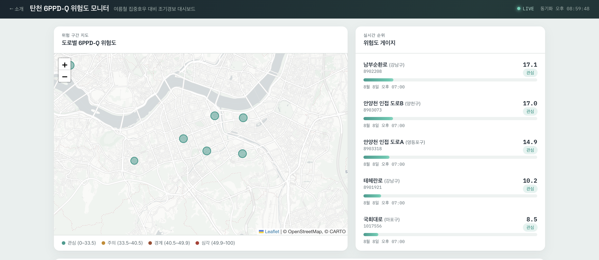
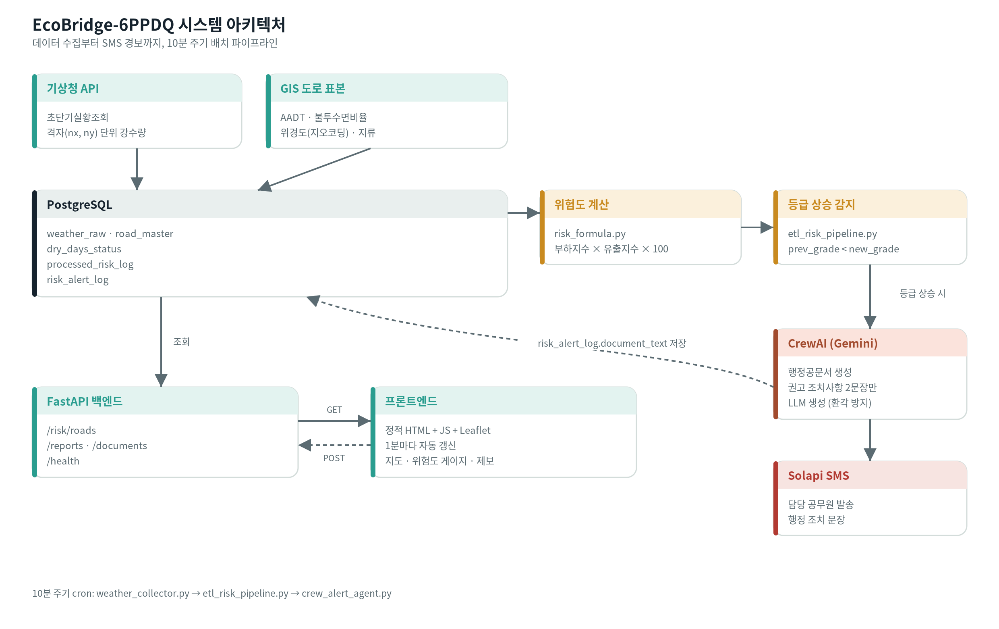

# 🌊 EcoBridge-6PPDQ

**탄천 6PPD-Q 하천 유입 조기경보 시스템** — 강수·교통·불투수면 데이터를 실시간으로 결합해 도로별 위험도를 계산하고, 등급이 상승하면 담당 공무원에게 자동으로 행정 공문서와 SMS를 보냅니다.

[](https://ecobridge-6ppdq.onrender.com/)




## 목차

- [왜 만들었나](#왜-만들었나)
- [아키텍처](#아키텍처)
- [기술 스택](#기술-스택)
- [시작하기](#시작하기)
- [위험도 산출 공식](#위험도-산출-공식)
- [API 엔드포인트](#api-엔드포인트)
- [알려진 한계](#알려진-한계--확인-필요-사항)
- [참고 자료](#참고-자료)

## 왜 만들었나

6PPD-Q는 타이어 마모 분진에서 나오는 물질로, 코호 연어를 비롯한 수생 생물에 치명적인 것으로 보고돼 있습니다(Tian et al., 2021, *Science*). 국내엔 아직 실측 모니터링 체계가 없어서, 이 프로젝트는 공개 데이터(강수·선행 무강우일수·교통량·불투수면비율)만으로 위험도를 사전 추정하는 조기경보 체계를 목표로 만들었습니다. 한강 유역 5개 지류(탄천·중랑천·안양천·홍제천·성내천) 15개 도로를 파일럿 표본으로 삼았습니다.

> ⚠️ 여기서 계산하는 "위험도"는 실측 6PPD-Q 농도가 아니라 논문 기반 대리 지표를 조합한 시뮬레이션 지표입니다. 자세한 내용은 [알려진 한계](#알려진-한계--확인-필요-사항) 참고.

## 아키텍처



10분 주기 cron이 `weather_collector.py → etl_risk_pipeline.py → crew_alert_agent.py` 순서로 돌며, 등급이 상승한 경우에만 CrewAI가 공문서를 생성하고 Solapi로 SMS를 보냅니다.

## 기술 스택

| 영역 | 기술 |
|---|---|
| 데이터 수집 | Python, 기상청 단기예보 조회서비스 API, 카카오 로컬 API(지오코딩 폴백) |
| 저장소 | PostgreSQL |
| 백엔드 API | FastAPI, SQLAlchemy |
| AI 에이전트 | CrewAI + Google Gemini(`gemini-3.5-flash`) |
| SMS 알림 | Solapi |
| 프론트엔드 | 정적 HTML/JS + Leaflet(지도) |
| 인프라 | Docker / docker-compose, cron |

## 시작하기

### Docker (권장)

```bash
git clone https://github.com/Jongwon-J/Python-R-6PPD-Q-.git
cd Python-R-6PPD-Q-

cp .env.example .env   # 아래 환경변수 표를 채워넣기

docker compose up --build
```

- 프론트엔드: http://localhost:8080 · 백엔드 API: http://localhost:8000 (헬스체크 `/health`)
- DB는 컨테이너 전용 볼륨을 쓰고 호스트 포트 `5433`으로 노출되어, 로컬에 PostgreSQL이 떠있어도 충돌하지 않습니다.
- 데이터 수집·위험도 계산 파이프라인은 Docker에 포함돼 있지 않으므로, 아래 "데이터 파이프라인 실행"을 별도로 돌려야 대시보드에 실제 데이터가 채워집니다.

<details>
<summary><b>로컬 개발 환경 (직접 실행)</b></summary>

**요구 사항**

- Python 3.10 이상 (CrewAI가 3.10+ 요구), PostgreSQL 14 이상
- 기상청 API 인증키 ([공공데이터포털](https://www.data.go.kr/data/15084084/openapi.do), "기상청_단기예보 조회서비스" 활용신청)
- 카카오 REST API 키 ([Kakao Developers](https://developers.kakao.com), 위경도 없는 도로 추가 시에만 필요)
- Google Gemini API 키 ([Google AI Studio](https://aistudio.google.com), 무료)
- Solapi API 키/시크릿 ([solapi.com](https://solapi.com), 발신번호 사전 등록 필요)

**설치**

```bash
git clone https://github.com/Jongwon-J/Python-R-6PPD-Q-.git
cd Python-R-6PPD-Q-

python -m venv venv
source venv/bin/activate        # Windows: venv\Scripts\activate

pip install -r data_pipeline/requirements.txt
pip install -r app/requirements.txt

cp .env.example .env
```

**DB 스키마 적용**

```bash
psql -U postgres -d tancheon_risk -f data_pipeline/schema.sql
```
(`CREATE TABLE IF NOT EXISTS` + `ADD COLUMN IF NOT EXISTS` 패턴이라, 기존 DB에 다시 실행해도 안전합니다.)

**도로 표본 적재**

```bash
python data_pipeline/import_gis_road_master.py        # 위경도가 이미 있는 표본
python data_pipeline/geocode_and_import_road_master.py # 주소만 있는 경우 (카카오 지오코딩)
```

**데이터 파이프라인 실행**

```bash
python data_pipeline/weather_collector.py    # 실시간 강수량 수집
python data_pipeline/etl_risk_pipeline.py    # 위험도 계산 + 등급 상승 감지
python data_pipeline/crew_alert_agent.py     # 등급 상승 시 공문서 생성 + SMS 발송
```

정상 동작이 확인되면 `data_pipeline/run_pipeline.sh`를 cron에 10분 주기로 등록합니다.
```cron
*/10 * * * * /path/to/project/data_pipeline/run_pipeline.sh >> /path/to/project/data_pipeline/pipeline.log 2>&1
```
> macOS는 cron이 Desktop/Documents/Downloads에 접근할 때 TCC 정책에 막힐 수 있습니다 — 시스템 설정 > 개인정보 보호 및 보안 > 전체 디스크 접근 권한에 `/usr/sbin/cron` 추가.

**백엔드 / 프론트엔드 실행**

```bash
uvicorn app.main:app --reload --port 8000

cd frontend && python3 -m http.server 8080
```

</details>

<details>
<summary><b>환경변수</b></summary>

| 변수명 | 설명 |
|---|---|
| `KMA_SERVICE_KEY` | 기상청 API 인증키 (Decoding 키) |
| `KAKAO_REST_API_KEY` | 카카오 로컬 API REST 키 (선택) |
| `DB_HOST` / `DB_PORT` / `DB_NAME` / `DB_USER` / `DB_PASSWORD` | PostgreSQL 접속 정보 |
| `TANCHEON_TARGET_POINT` / `TANCHEON_NX` / `TANCHEON_NY` | road_master가 비어있을 때 쓰는 폴백 지점 |
| `DRY_DAY_THRESHOLD_MM` | 무강우 판정 기준 강수량(mm/day) |
| `GEMINI_API_KEY` | CrewAI가 호출하는 Google Gemini API 키 |
| `SOLAPI_API_KEY` / `SOLAPI_API_SECRET` | Solapi API 인증 정보 |
| `SOLAPI_FROM_NUMBER` | Solapi에 등록한 발신번호 |
| `SOLAPI_TO_NUMBER` | 등급 상승 알림을 받을 담당 공무원 번호 |
| `UPLOAD_DIR` | 시민 제보 이미지 저장 경로 (기본 `uploads/reports`) |
| `ADMIN_TOKEN` | 시민 제보 상태 변경 인증 토큰. 비워두면 관리 기능 항상 차단(fail-safe) |

</details>

## 위험도 산출 공식

```
부하지수 = 0.6 × AADT_정규화 + 0.4 × 건조일수_정규화
유출지수 = 0.7 × 강수트리거 + 0.3 × 불투수면_정규화
위험도(0~100) = 부하지수 × 유출지수 × 100
```

- 덧셈이 아닌 곱셈 구조 — 강수가 없으면 위험도가 0으로 수렴
- AADT·불투수면비율은 절대 스케일이 아닌 표본 내 상대(min-max) 정규화
- 가중치(0.6/0.4, 0.7/0.3)는 King & Rodgers(2025)·Halama et al.(2024) 등 개별 변수 논문의 상대적 영향력에 근거한 방향성 근사값 — 정밀 회귀계수 아님

### 위험도 등급 (4단계)

| 등급 | 위험도 범위 | 근거 |
|---|---|---|
| 관심 | 0 ~ 33.5 | 표본(n=15) 사분위수 하위 25% |
| 주의 | 33.5 ~ 40.5 | 25~50% |
| 경계 | 40.5 ~ 49.9 | 50~75% |
| 심각 | 49.9 초과 | 상위 25% |

「재난 및 안전관리 기본법」 제38조(위기경보의 발령)와 대응되도록 4단계로 설계했습니다. 경계값은 현재 표본(n=15)의 사분위수 기준 상대치라, 표본이 늘어나면 재산정이 필요합니다.

## API 엔드포인트

| 메서드 | 경로 | 설명 |
|---|---|---|
| GET | `/risk/roads` | 도로별 최신 위험도 점수·등급 조회 |
| GET | `/reports/` | 시민 제보 목록 (상태 필터·페이지네이션) |
| POST | `/reports/` | 시민 제보 등록 (위경도·설명·사진) |
| PATCH | `/reports/{id}/status` | 제보 상태 변경 (관리자 토큰 필요) |
| GET | `/documents/` | 생성된 경보 공문서 목록 |
| GET | `/documents/latest` | 가장 최근 공문서 |
| GET | `/documents/{id}/download` | 공문서 다운로드(.txt) |
| GET | `/health` | 헬스체크 |

## 알려진 한계 / 확인 필요 사항

- 위험도는 실측 6PPD-Q 농도가 아니라 시뮬레이션 기반 대리 지표이며, 국내 실측 데이터로 검증된 적이 없습니다.
- 산식 가중치(0.6/0.4, 0.7/0.3)는 소표본(n=4) 문헌 기반 방향성 근사값으로, 정밀 회귀계수가 아닙니다.
- 등급 경계값(33.5/40.5/49.9)은 현재 표본(n=15)의 상대적 분포이며 절대 기준이 아닙니다. 표본 확대 시 재산정이 필요합니다.
- 공무원 SMS 알림은 국가재난안전통신망(긴급재난문자/CBS)과 무관한 부서 내부 알림이며, 이를 대체하지 않습니다.
- 기상 데이터는 기상청 5km 격자 단위로 수집되어, 같은 격자의 도로들은 동일한 강수값을 공유합니다 — 국지적 강우 편차는 반영하지 못합니다.

## 참고 자료

- Tian et al., 2021, *Science* — 6PPD-Q 코호 연어 급성 독성(LC50) 최초 규명
- King & Rodgers, 2025 — 강우 발생 후 6PPD-Q 하천 농도 급상승(first flush) 실측
- Halama et al., 2024 — 선행 건조일수(ADD)에 따른 6PPD-Q 농도 변화
- Helm et al., 2024 — 도로밀도(불투수면 프록시)에 따른 6PPD-Q 농도 차이
- [기상청_단기예보 조회서비스 (공공데이터포털)](https://www.data.go.kr/data/15084084/openapi.do)
- [격자좌표 변환 로직(LCC DFS)](https://gist.github.com/fronteer-kr/14d7f779d52a21ac2f16)
- [카카오 로컬 API 개발 가이드](https://developers.kakao.com/docs/latest/ko/local/dev-guide)
